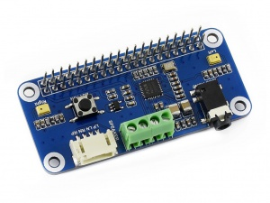

# Audio Codec (WM8960)

### Overview

This library provides functions to support the WM8960 audio codec. The Codec is connected via __I2S__ for the audio data and is configured via __I2C__.

It can drive some speakers via the amplifier output and supports full duplex mode where we can both read and write audio data at the same time.

This library is based on the [original provided by Infineon](https://github.com/Infineon/audio-codec-wm8960) and has been adapted for Arduino to use the Wire API.

### Documentation

- [API](https://pschatzmann.github.io/arduino-wm8960/docs/html/group__wm8960.html)

### WM8960 Audio HAT

Func   | Module | Description
-------|--------|-----------------------------------
5V     | 5V	    | Power positive (5V power input)
GND	   | GND	| Power Ground
SDA	   | P2/SDA | I2C data input
SCL	   | P3/SCL | I2C clock Input
CLK	   | P18	| I2S bit clock input
LRCLK  | P19	| I2S frame clock input
DAC	   | P21	| I2S serial data output
ADC	   | P20	| I2S serial data input
Button | P17	| Configurable Button

